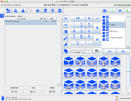
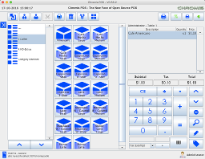
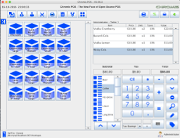

## Chromis POS

Source code for Wildfox Edition 1704v1 build of Chromis POS Application Version 0.56.2 

   

### Additional Fixes and Supported Features

* Ability to add custom scan code handling for coupons or products(see README.txt).
* Syntax Highlighting in resource editor (provided by Jacob Mellin fork)
* Printer Template fixes (see README.txt)
* Completed code for insert or update of products from Stock Diary Panel
* Hide users list on login screen (see README.txt)
* Hide catalog icons on sales screen (see README.txt)
* Additional 3 Sales Screens Layouts
* Network connection timeout drop recovery
* Fixed Stock level retrievals
* Fixed number checking on sales screen

### Building JAR file

See [Netbeans Installation Manual](https://sourceforge.net/projects/chromispos/files/Source%20Code/)

### Updating an existing Chromis POS 0.56.2 installation

Make sure to test the build before using in a live environment, make a working
backup of the database, and empty the SHAREDTICKETS table(items in the layways 
and on restaurant tables) in the database before upgrading.

In the program's directory, rename existing chromispos.jar to chromispos.jar.old
 then copy in the new build of chromispos.jar 

Make the following changes to the following locales files and the locale files
for your language:

#### pos_messages.properties

* form.insertProduct=Insert Product 
* form.updateProduct=Update Product
* Label.HideCatalogIcons=Hide Catalog Icons

Copy over <b>rsyntaxtextarea-2.6.0-SNAPSHOT.jar</b> in the lib directory to the
chromis program's lib directory.

### Notes for updating from an older Chromis POS database to 0.56.2 
If you used this jar to update from a Unicenta or a previous version of Chromis POS,
 you will encounter Liquidbase change set checksum issues when doing so or when updating
to the next version of Chromis POS.
 
This will likely involve these 2 update keys <b>Drop LEAVES_PPLID</b> and <b>Add LEAVES_PPLID</b>
in the table DATABASECHANGELOG. To fix this issue in either case you have to set
the MD5SUM to null for these 2 entries by using the following SQL commands:

* update databasechangelog set MD5SUM=null where id like 'Drop LEAVES_PPLID';
* update databasechangelog set MD5SUM=null where id like 'Add LEAVES_PPLID';

### Notes for custom scan code processor script
This custom code of Chromis POS supports custom scan code handling routine. 
If you want to use this, you will have to setup the event key called 
<b>ticket.customercodeprocessor</b> to link to your code script. 
I have added a sample script in the template directory which you can add to your resources. 
The code will be passed into the script using a String variable called <b>sCode</b> for processing. 

I have included a sample script <b>Ticket.CustomBarcodeHandler.bsh</b> in uk.chromis.pos.templates directory as a reference. 
This script is a partial GS1 standard code processor implementation to store the Expiry and Lot within the ticket line attributes.
On success the script will return a valid TicketLineInfo class with the expiry data or lot number within its attributes if either is available.
On failure the script will return nothing.
